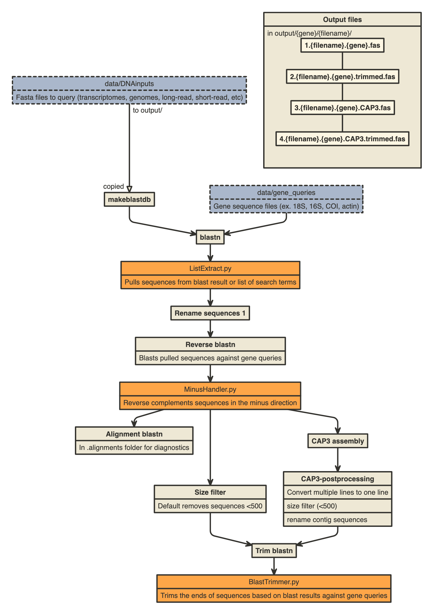

# seqpull

Use a file of gene queries to pull similar sequences from short-read nucleotide datasets, assemble gene contigs, reverse complement, and trim sequences based on blast results.

Functions:
- Pull gene sequences from datasets using a high throughput snakemake pipeline.
- CAP3 assembly of pulled sequences (useful for short-read sequences, not long-read).
- Autoreverse complements sequences based on blast results against the top gene queries.
- Trims sequence ends based on blast results against the top gene queries.
- Sequence size filter (default: <500bp sequences are removed).
- Sequences and output files are automatically named based on input file names and gene file names.
- Easy-to-parse directories and file names.
- Useful logs.

Potential uses:
- Pull marker genes for organism identification (18S, 16S, COI).
- Find virus-related genes in organism transcriptomes.

## Quickstart

### Python environment

conda install -n base -c conda-forge mamba
mamba create -n seqpull -c conda-forge -c bioconda snakemake biopython cap3 blast

or 

conda create -n seqpull -c conda-forge -c bioconda snakemake biopython cap3 blast

conda activate seqpull

### Running the seqpull pipeline

1. Put fasta files you want to pull sequences from in the data/DNAinputs directory. (must end with .fas or .fasta to be recognized)
2. Put fasta files you want to use as gene queries in the data/gene_queries directory. (must end with .fas or .fasta to be recognized)
    - Provided queries include 18S, 16S, and actin genes. Please curate your own queries depending on the target organisms and genes.
3. Move to code directory.
4. Do a dry run: snakemake -n
    - Allows you to preview every step of the pipeline and every file being generated.
5. Run bash script: bash seqpull.sh 
    - Modify cores/threads first 
    - Optionally, use in a queue system.
6. From the terminal you can run:
    - snakemake --cores 4 --keep-going > log.txt

## Pipeline overview

